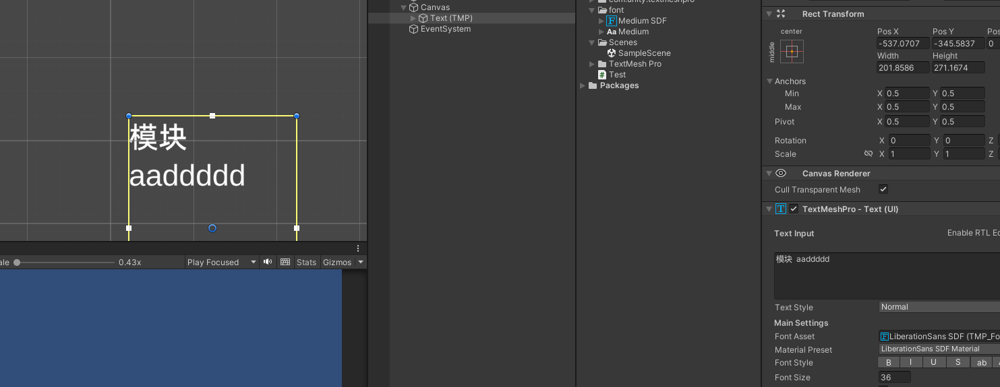
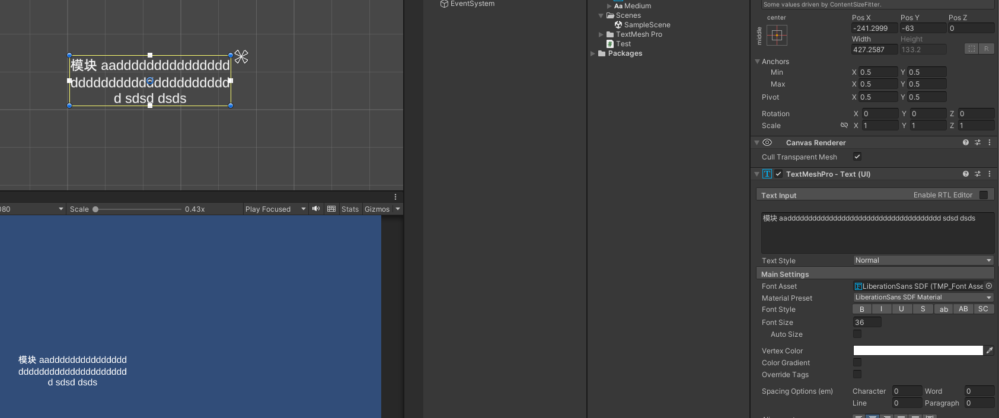

# TextMeshPro3.0.8-extend
       
       fix Line break

        // Usage 1: OnMaterialAssetRequest funtion Dynamic loading Material

        //TMP_Text.OnFontAssetRequest += (hashcode, asset) =>
        //{
        //    TMP_FontAsset font = resource.LoadAssetSync<TMP_FontAsset>(asset);

        //    return font;
        //};

        //TMP_Text.OnMaterialAssetRequest += (asset) =>
        //{
        //    Material material = resource.LoadAssetSync<Material>( asset);
        //    return material;
        //};
        //TMP_Text.OnSpriteAssetRequest += (asset) =>
        //{
        //    TMP_SpriteAsset sprite = resource.LoadAssetSync<TMP_SpriteAsset>(asset);

        //    return sprite;
        //};

        //resource: use your resource sync load funtion

        //Usage 2: TextMeshProUGUI  IPointerClickHandler event

        GetComponent<TextMeshProUGUI>().text = "<link=\"Url:https://www.google.com\"><color=#ffa200ff><u>https://www.google.com</u></color></link>";
        GetComponent<TextMeshProUGUI>().OnPointerClickEvent((str, pos) =>
        {
            if (str.StartsWith("Url:"))
            {
                Application.OpenURL(str.Remove(0, 4));
            }
        });
        // note: if use  Button/Text (TMP),toogle off the TextMeshProUGUI.raycastTarget

        //Usage 3:
        //When all resources need to be uninstalled after the hot update is completed
        //TextMeshPro need to clean up the loaded materials

        MaterialReferenceManager.instance.Clear();

        var tmps = GetComponentsInChildren<TextMeshProUGUI>();
        foreach (var text in tmps)
        {
            text.UpdateFontAsset();
            text.SetAllDirty();
        }//refresh text

        //Usage 4: add language id for localization
        var languageid = GetComponent<TextMeshProUGUI>().m_Language;

      // GetComponent<TextMeshProUGUI>().text=GetStrByID( languageid);
